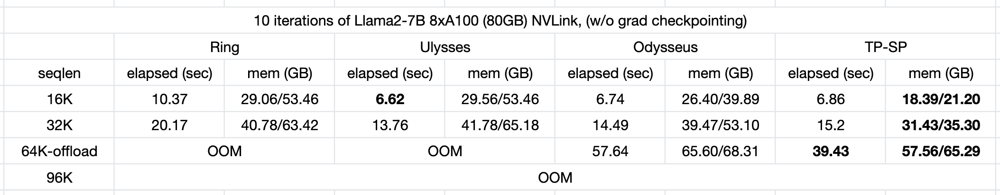
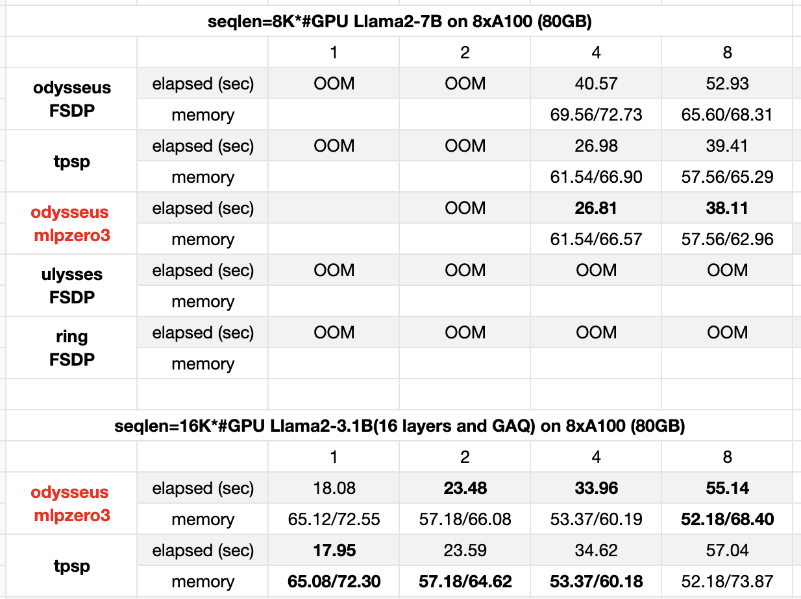

## Odysseus: Playground of LLM Sequence Parallelism 
The repository serves as a playground for variant sequence parallelism implementations.
This repository delves into a set of parallelization strategies for long-sequence LLMs, implementing four methods: 
1. [Tensor Parallelism with Sequence Parallelism (TP-SP)](https://arxiv.org/abs/2205.05198), refer to MLSys 23' paper: Reducing Activation Recomputation in Large Transformer Models.
2. [DeepSpeed-Ulysses](https://arxiv.org/abs/2309.14509), refer to the paper: DeepSpeed Ulysses: System Optimizations for Enabling Training of Extreme Long Sequence Transformer Models. Apply the implementation from [feifeibear/long-context-attention](https://github.com/feifeibear/long-context-attention).
3. [Ring-Attentions](https://arxiv.org/abs/2310.01889), refer to the paper: Ring Attention with Blockwise Transformers for Near-Infinite Context. Apply the implementation from [zhuzilin/ring-flash-attention](https://github.com/zhuzilin/ring-flash-attention)
4. Odysseus. A novel method is proposed in this repo.

As illustrated in the below figure, **Odysseus**, our innovative sequence parallelization strategy, decouples the parallelization of Attention and MLP within Transformers. 
For Attention, it utilizes TP-SP to split Q, K, V, O Linear weights and uses allgather for input tensors and reducescatter for output tensors, segmenting Activation by sequence dimension. 
MLP implements naive sequence parallelism, splitting input by sequence dimension without requiring communication on activation but needs synchronization on gradients during backpropagation.
**The communication cost of the Odysseus is higher than Ulysses on large GPU scale.**
**The communication cost of the Odysseus is better than TP-SP on long sequence scenarios.**
Odysseus can be used can be used orthogonally with Ring-Attention.


<div align="center">
    
</div>

The communication and memory costs of these four methods are summarized in the table below. Among them, RS stands for ReduceScatter, and AG stands for AllGather. L represents the sequence length, d is the hidden dimension, i is the intermediate hidden size, with GPT-4 having i = 4d, and N denotes the number of GPUs.

When the sequence length $L$ exceeds the intermediate hidden size $i$ ($L$ > i), Odysseus+ZeRO3 demonstrates a lower communication cost compared to TP-SP and Ulysses+ZeRO3. Notably, all three methods maintain similar memory consumption.

| Method          | Comm Activation | Comm Volume       | Comm Gradient | Comm Volume                   | Mem Activation | Mem Param/Grad |
|-----------------|------------|--------------|----------|--------------------------|------------|------------|
| TP              | 2AllReduce | 8O(Ld)       | 0        | 0                        | full       | 1/N        |
| TP-SP           | 6RS+4AG    | 10O(Ld)       | 0        | 0                        | 1/N        | 1/N        |
| Ulysses+ZeRO3   | 8All2All   | 8O(Ld)/P      | RS+2AG (Full) | 4O($d^2$)+3O(di)           | 1/N        | 1/N      |
| Ring+ZeRO3      | P2Ps       | 4O(Ld)       | RS+2AG (Full) | 4O($d^2$)+3O(di)           | 1/N        | 1/N      |
| Odysseus+ZeRO3  | 3RS+2AG    | 5O(Ld)       | RS+2AG (MLP) | 3O(di) | 1/N        | 1/N        |


We conducted a benchmark of the four methods on 8xA100 GPUs, with a global batch size of 1 and without applying gradient checkpointing or offload. The elapsed time and memory usage are presented below. **The results differ from the analysis presented above.**

1. Odysseus and TP-SP demonstrates the better memory efficiency than Ulysses and Ring. Despite the theoretical equivalence in memory consumption between the four methods, we suspect that FSDP's memory efficiency is inferior to manually partitioning the weights of Linear layers.
2. Odysseus and TP-SP exhibit similar speed. However, the Odysseus MLP ZeRO modules, where both AG (AllGather) and RS (ReduceScatter) operation are synchronized, still has room to improve by applying async versions.

<div align="center">
    
</div>

<div align="center">
    
</div>

### Usage
1. Install requirements.txt
2. Install [feifeibear/long-context-attention](https://github.com/feifeibear/long-context-attention), and [zhuzilin/ring-flash-attention](https://github.com/zhuzilin/ring-flash-attention).
3. bash run.sh


### Acknowledgements

[jzhang38/EasyContext](https://github.com/jzhang38/EasyContext)

### Citation

If you apply Odysseus in you project, I I kindly request that you acknowledge my contribution with the following citation.

```
@misc{fang2024odysseus,
  title={Odysseus: Upgrade DeepSpeed-Ulysses by Decoupling the Parallel Strategies of Attention and MLP},
  author={Fang, Jiarui},
  howpublished={\url{https://github.com/feifeibear/Odysseus-Transformer}},
  year={2024},
}
```