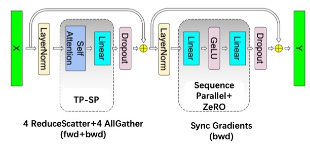

## Odysseus: Upgrade DeepSpeed-Ulysses by Decoupling the Parallel Strategies of Attention and MLP

This repository delves into the optimal parallelization strategies for long-sequence LLMs, implementing three methods: 
1. [Tensor Parallelism with Sequence Parallelism (TP-SP)](https://arxiv.org/abs/2205.05198), refer to MLSys 23' paper: Reducing Activation Recomputation in Large Transformer Models.
2. [DeepSpeed-Ulysses](https://arxiv.org/abs/2309.14509), refer to the paper: DeepSpeed Ulysses: System Optimizations for Enabling Training of Extreme Long Sequence Transformer Models. Apply the implementation from [feifeibear/long-context-attention](https://github.com/feifeibear/long-context-attention).
3. [Ring-Attentions](https://arxiv.org/abs/2310.01889), refer to the paper: Ring Attention with Blockwise Transformers for Near-Infinite Context. Apply the implementation from [zhuzilin/ring-flash-attention](https://github.com/zhuzilin/ring-flash-attention)
4. Odysseus. A novel method is proposed in this repo.

As you can see, we involve both tensor parallelism and sequence parallelism here.
The commonality among these methods is that they all require partitioning along the head number dimension, thus the degree of parallelism is constrained by the head number. We have excluded Ring-Attention as it can be used orthogonally with these three methods.

As illustrated in the below figure, **Odysseus**, our innovative sequence parallelization strategy, decouples the parallelization of Attention and MLP within Transformers. For Attention, it utilizes TP-SP to split Q, K, V, O Linear weights and uses allgather for input tensors and reducescatter for output tensors, segmenting Activation by sequence dimension. MLP implements naive sequence parallelism, splitting input by sequence dimension without requiring communication on activation but needs synchronization on gradients during backpropagation.

    

The communication and memory costs of these four methods are summarized in the table below. Among them, RS stands for ReduceScatter, and AG stands for AllGather. L represents the sequence length, d is the hidden dimension, i is the intermediate hidden size, with GPT-4 having i = 4d, and N denotes the number of GPUs.

When the sequence length $L$ exceeds the intermediate hidden size $i$ ($L$ > i), Odysseus+ZeRO3 demonstrates a lower communication cost compared to TP-SP and Ulysses+ZeRO3. Notably, all three methods maintain similar memory consumption.

| Method          | Comm Activation | Comm Volume       | Comm Gradient | Comm Volume                   | Mem Activation | Mem Param/Grad |
|-----------------|------------|--------------|----------|--------------------------|------------|------------|
| TP              | 2AllReduce | 4O(Ld)       | 0        | 0                        | full       | 1/N        |
| TP-SP           | 4RS+4AG    | 4O(Ld)       | 0        | 0                        | 1/N        | 1/N        |
| Ulysses+ZeRO3   | 4All2All   | 4O(Ld)       | AllReduce| 4O($d^2$)+2O(di)           | 1/N        | 1/N      |
| Odysseus+ZeRO3  | 2RS+2AG    | 2O(Ld)       | AllReduce (MLP) | 2O(di) | 1/N        | 1/N        |

### Usage
1. Install requirements.txt
2. Install [feifeibear/long-context-attention](https://github.com/feifeibear/long-context-attention)
3. bash run.sh

### TODO:
The repo is still work in progress.

1. Our TP-SP implementation stores the full shape tensor after allgather in GPU memory before the backward pass, resulting in an Activation memory cost greater than 1/N. Our implementation does not strictly adhere to the paper. Gradient checkpointing should be developped for TP-SP.

2. Integrate Odysseus with Ring for hybrid parallelism.

3. Now, the tesh code only support batch size=1. Hybriding with Data parallel is not considered.

### Acknowledgement

[jzhang38/EasyContext](https://github.com/jzhang38/EasyContext)